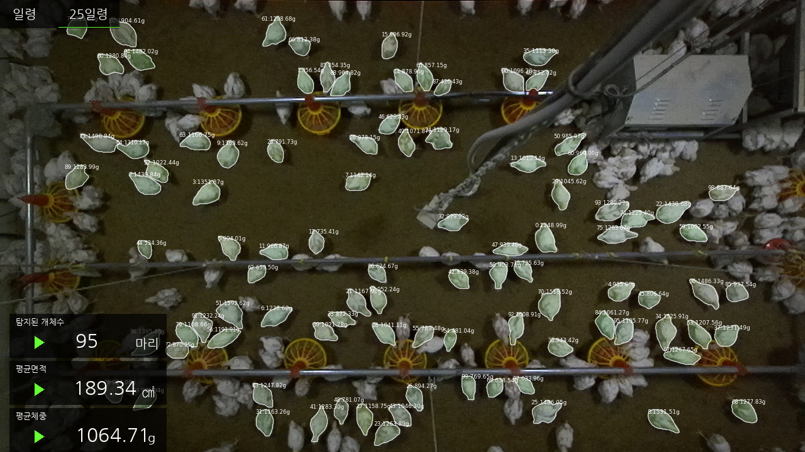

# Broiler + Handy = BRODY

This is Broiler Weight Prediction Program which is based on 3D Computer Vision.
This program receives RGB data and depth data as input and outputs the average weight of broilers detected in the video.

<p align="center"></p>


## 🎯 Technical issues & Resolution process

* [[BRODY] 3D Computer vision 기반 가축 체중측정 서비스](https://dohyeon.tistory.com/95)


## :heavy_check_mark: Tested

| Python | pytorch |  Windows   |   Mac   |   Linux  |
| :----: | :-----: | :--------: | :-----: | :------: |
| 3.8.0+ | 1.10.0+ | X | X |  Ubuntu 18.04 |


## :arrow_down: Installation

Clone repo and install [requirements.txt](https://github.com/dohyeonYoon/BRODY/blob/main/requirements.txt) in a
**Python>=3.8.0** environment, including
[**PyTorch>=1.10.0**](https://pytorch.org/get-started/locally/).

(tested environment cuda 11.3, cudnn 8.2.1 for cuda 11.x)

```bash
pip install torch==1.12.1+cu113 torchvision==0.13.1+cu113 --extra-index-url https://download.pytorch.org/whl/cu113
pip install -U openmim
mim install mmcv-full
git clone https://github.com/dohyeonYoon/BRODY  # clone
cd BRODY
pip install -r requirements.txt  # dependency install
cd BRODY/src/mmdetection/source
pip install -v -e . # mmdet install
```


## :rocket: Getting started

You can inference with your own custom RGB, PGM file in /BRODY/src/input/rgb, /BRODY/src/input/depth folder.
```bash
cd src
python pyBRODY.py

```


## :file_folder: Pretrained Checkpoints
Please place the downloaded **weights** and **dataset** directories in /BRODY/src/mmdetection/ directory respectively.
(The download of the checkpoint file is temporarily unavailable)

[weight](https://drive.google.com/drive/folders/1ihPrR4gd-3p5L3Law2IJRkMRKVKh5a_5?usp=sharing)  # Mask-RCNN Weights

[dataset](https://drive.google.com/drive/folders/1t8jNL5OWvgEK40qNJGtwHOJ1UWu3ahVa?usp=sharing)  # Datasets
